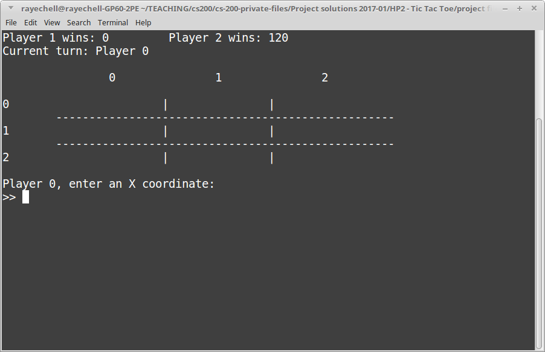
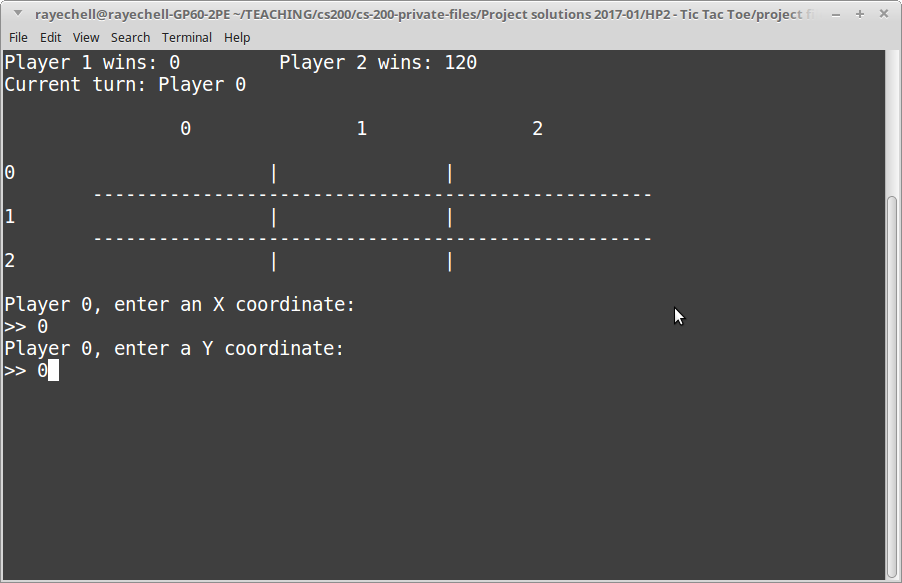
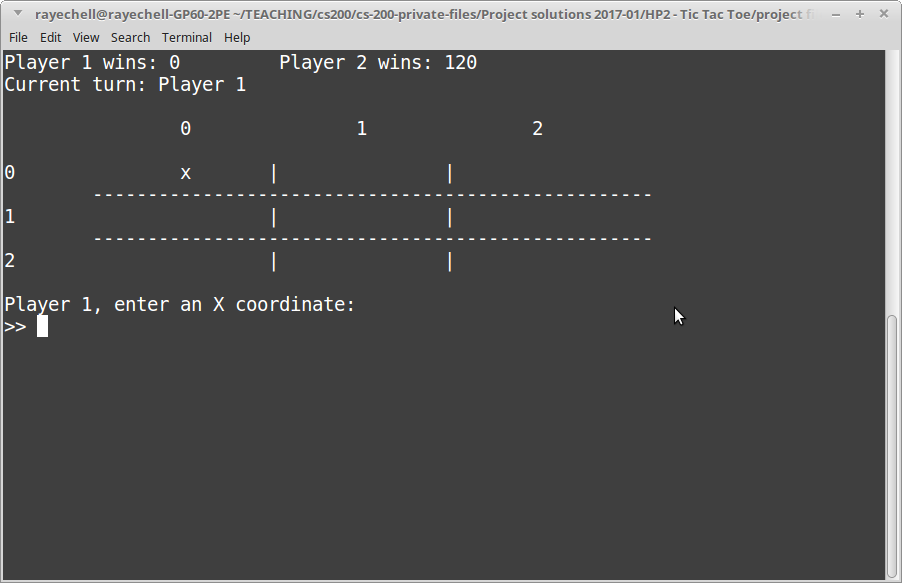
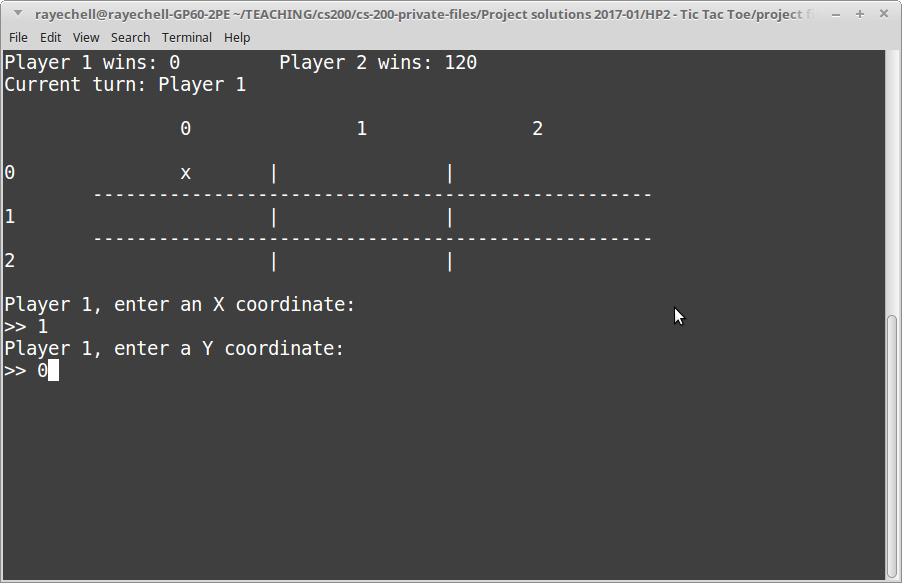
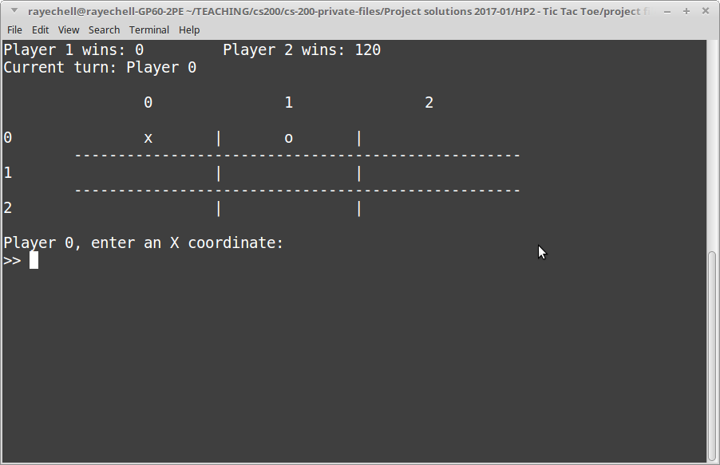

# Homework Project 2: Tic Tac Toe

## Downloads

Download the **starter project**. This folder contains the code, as well as a Visual Studio project and a Code::Blocks project.

Extract the zip file somewhere to your hard drive.

**To open in Visual Studio**

Open the following file:

	project files/HP2 - Visual Studio/HP2 - Visual Studio.sln

This is marked as "Microsoft Visual Studio Solution" in Windows.

**To open in Code::Blocks**

Open the following file:

	project files/HP2 - CodeBlocks/HP2 - CodeBlocks.cbp

This is marked as "CBP File" in Windows.

## Rules

* Open book / Open note:

	* Do research for this assignment as-needed. Use your textbook, the web, class example code, etc.
 
* Solo work:

	* This is a solo assignment and you should be working on this alone. This means...:
	
    	* ✓ You can verbally brainstorm with others to discuss the problem and techniques for problem solving.
    	* ✓ Your work must be your own work.
    	* ✓ Email the instructor, or ask in the Slack channel, if you are stuck or need clarification on the instructions.
    	* ✗ You cannot give your code to somebody else for them to "verify their work" with (more often than not they just copy it, and then you both get 0%!)
    	* ✗ You cannot copy another student's work. I will use a diff tool to compare student assignments (and code online). If there is obvious copying, all people involved will receive a 0%.

## Turn in

When you're ready to turn in your work, upload the following files:

	hp2_program.hpp
	hp2_program.cpp

file to your GitHub repository, and to the D2L Dropbox.

### General turn in information

**You will need to upload your code both to the class D2L Dropbox, and to your CS 200 GitHub repository!**

Locate your source files for this project. They should have the extentions .cpp, .hpp, and/or .h. In Windows, they are labelled as "C++ source file" and/or "Header file". 

**These are the only files you need** - You do not need to upload any Visual Studio files.

Upload these source files to your GitHub repository and to the Dropbox.

## Reference Information

* [How to turn in your source code](https://github.com/Rachels-Courses/Course-Common-Files/blob/master/How-to/Turning%20in%20source%20code.md)
* [Visual Studio - How to create a new project](https://github.com/Rachels-Courses/Course-Common-Files/blob/master/How-to/New%20project%20-%20Visual%20Studio.md)
* [Common programming errors](https://github.com/Rachels-Courses/Course-Common-Files/blob/master/Review/Common-errors.md)

---

# Note: Change in grading!

If your program does not build, 
you will get 0% for the assignment.

Make sure your program builds 
and runs above all else.
If it doesn't run, 
you cannot run the unit tests!

Work on one feature at a time, test, and
BACKUP to your GitHub account after
each feature! Then you can view
the history over time.

---

# Introduction

## Review

* 2D arrays

## Files

* hp2_program.hpp
* hp2_program.cpp
* hp2_tester.hpp
* hp2_tester.cpp
* Menu.hpp
* StringUtil.hpp
* TesterBase.hpp
* TesterBase.cpp

## Unit tests

---

# Don't write everything at once.

Don't write a ton of code all at once - write a small feature, then COMPILE to make sure your program builds, and run to make sure it runs.

---

# Private member variables

These variables are part of the **Program** class and you will use them throughout the functions.

    char gameBoard[3][3];
    int turn;
    int playerWins[PLAYER_COUNT];
    int playerMarker[PLAYER_COUNT];

* gameBoard - A 2D array that stores **characters** - either empty (' '), or a player piece 'x' or 'o'.
* playerMarker - A 1D array with 2 elements. playerMarker 0 should be 'x', and playerMarker 1 should be 'o'.
* turn - An integer to mark whose turn it is; this should correspond to the playerMarker (turn can be 0 or 1.)
* playerWins - A 1D array. Count the amount of times that player 0 has won, and player 1 has won, in this array.

---

# Function Specifications

## void Main()

Program entry point. Sets up the program and begins the game loop.

## void Setup()

* Should initialize all ELEMENTS of the gameBoard to a space character: ' '
* Set the turn marker to 0
* Set playerWins for both players to 0
* Set playerMarker for each player: 'x' and 'o'.

## void ClearBoard() - Done

Clear the game board of all pieces

## void GameLoop()

Create a game loop that will keep running until the user quits.
Each cycle of the loop, call DrawStats() and DrawBoard(),
then have the player choose an x, y coordinate.

The **turn** variable can be utilized to keep track of whether it is player 0's turn, or player 1's turn.
**turn** will store either 0 or 1 as a value.

Use the *PlaceMarker* function to attempt to place the player's
marker at the given x, y. If successful, then go to the other
player's turn. (Otherwise, they will have to select again.)

Use the *CheckForWinner* function to see if there is a winner yet.
If there is a winner, increment the *playerWins* array for the
appropriate player (add 1 to the player's wins), then 
leave the game loop and return to Main.

## int GetValidInput( int min, int max )

**INPUT:** A minimum numeric value (int min), and a maximum numeric value (int max),
corresponding to a number menu, or positions on the Tic Tac Toe board.

**OUTPUT:** The user's input, but only input that is *min <= input <= max*.

* Get user to enter their decision via a **cin** command.
* While their input is invalid (input < min or input > max), have them re-enter their selection.
* Return the user's input once valid input has been provided.

This function is meant to be generic so that *anything* can call it to get validated input; not just x, y coordinates of the board.

## void DrawBoard() - DONE

This draws the 2D game board.

This function is already implemented.

## void DrawStats()

Display game stats:

* Display how many wins each player has had - **playerWins** array
* Display whose turn it is - **turn** variable

## int GetCurrentPlayerTurn()

**OUTPUT:** The value of the *turn* variable.

This only returns your **turn** variable.

## void SwapTurn()

Change to the other player's turn. (Modify the *turn* variable.)

In other words, if the **turn** variable is 0, change it to 1. If it is 1, change it to 0.

## bool PlaceMarker( int x, int y, char marker )

**INPUT:** A position on the game board (x, y coordinates), and
the marker (game piece) of one of the players.

**OUTPUT:** A boolean - whether the player's move was successful or not.

The **marker** variable stores either an 'x' or an 'o'; use this to set the board cell, *not* the playerMarker array.

First, check to see if the **gameBoard** at position **x, y** is empty. 

If it is empty, you can place the marker here. Update the **gameBoard** with your **marker** and return true.

If it is not empty, you CANNOT place the marker here. Don't change anything and return false.

## int CheckForWinner()

Check the gameBoard for various win-scenarios.
* Return -1 if nobody has a winning move, otherwise
* return 0 for player 0 win, and return 1 for player 1 win.
	( Player 0 should have 'x', Player 1 should have 'o'. )

OPTIONS: You can either use if-statements to make an exhaustive 
list of all possible win combinations (normal points).
There should be 8 possible winning moves, per player.
(See documentation)

OR:

Use a more generic approach, where you can use for-loop(s) to iterate
through the game board positions and figure out if there is a winner
or not. **(Extra credit)**

---

# Extra Credit

## Option 1: CheckForWinner

Update CheckForWinner to be more generic, using loops to check all the cells for "3-in-a-row", instead of a big series of for-loops.

## Option 2: Add a third player

Update the program to work with three players!!11

---

# Sample output 

---

# Grading rubric

<table border="0" cellspacing="0" cellpadding="0" class="ta1"><colgroup><col width="12"/><col width="334"/><col width="339"/><col width="163"/><col width="162"/></colgroup><tr class="ro1"><td style="text-align:left;width:7.71pt; " class="Default"> </td><td colspan="4" style="text-align:left;width:216.34pt; " class="ce1">
Grading Rubric
</td></tr><tr class="ro1"><td style="text-align:left;width:7.71pt; " class="Default"> </td><td style="text-align:left;width:216.34pt; " class="ce2">
Name:
</td><td colspan="3" style="text-align:left;width:220pt; " class="ce8"> </td></tr><tr class="ro1"><td style="text-align:left;width:7.71pt; " class="Default"> </td><td style="text-align:left;width:216.34pt; " class="ce2">
Assignment:
</td><td colspan="3" style="text-align:left;width:220pt; " class="ce9">
HP2: Tic Tac Toe, CS 200
</td></tr><tr class="ro2"><td style="text-align:left;width:7.71pt; " class="Default"> </td><td style="text-align:left;width:216.34pt; " class="Default"> </td><td style="text-align:left;width:220pt; " class="Default"> </td><td style="text-align:left;width:105.76pt; " class="Default"> </td><td style="text-align:left;width:104.94pt; " class="Default"> </td></tr><tr class="ro1"><td style="text-align:left;width:7.71pt; " class="Default"> </td><td colspan="4" style="text-align:left;width:216.34pt; " class="ce1">
Breakdown
</td></tr><tr class="ro3"><td style="text-align:left;width:7.71pt; " class="Default"> </td><td colspan="4" style="text-align:left;width:216.34pt; " class="ce3">
IF YOUR PROGRAM DOES NOT BUILD, 

YOU WILL RECEIVE A SCORE OF 0%
</td></tr><tr class="ro4"><td style="text-align:left;width:7.71pt; " class="Default"> </td><td style="text-align:left;width:216.34pt; " class="ce4">
Item
</td><td style="text-align:left;width:220pt; " class="ce4">
Description
</td><td style="text-align:left;width:105.76pt; " class="ce4">
Total %
</td><td style="text-align:left;width:104.94pt; " class="ce4">
Your Score
</td></tr><tr class="ro5"><td style="text-align:left;width:7.71pt; " class="Default"> </td><td style="text-align:left;width:216.34pt; " class="ce5">
Clean code
</td><td style="text-align:left;width:220pt; " class="ce10">
Your code should have consistent indentation and be easy to read.
</td><td style="text-align:right; width:105.76pt; " class="ce14">
5.00%
</td><td style="text-align:left;width:104.94pt; " class="ce14"> </td></tr><tr class="ro6"><td style="text-align:left;width:7.71pt; " class="Default"> </td><td style="text-align:left;width:216.34pt; " class="ce6">
No crashes
</td><td style="text-align:left;width:220pt; " class="ce11">
Most common reason for crashing with arrays will be from going out-of-bounds.
</td><td style="text-align:right; width:105.76pt; " class="ce15">
10.00%
</td><td style="text-align:left;width:104.94pt; " class="ce15"> </td></tr><tr class="ro6"><td style="text-align:left;width:7.71pt; " class="Default"> </td><td style="text-align:left;width:216.34pt; " class="ce5">
No logic errors
</td><td style="text-align:left;width:220pt; " class="ce10">
Logic errors are harder to detect, but make your program inaccurate.
</td><td style="text-align:right; width:105.76pt; " class="ce14">
10.00%
</td><td style="text-align:left;width:104.94pt; " class="ce14"> </td></tr><tr class="ro6"><td style="text-align:left;width:7.71pt; " class="Default"> </td><td style="text-align:left;width:216.34pt; " class="ce6">
Setup()
</td><td style="text-align:left;width:220pt; " class="ce11">
Clear the board, initialize turn, playerWins, and playerMarker.
</td><td style="text-align:right; width:105.76pt; " class="ce15">
5.00%
</td><td style="text-align:left;width:104.94pt; " class="ce15"> </td></tr><tr class="ro7"><td style="text-align:left;width:7.71pt; " class="Default"> </td><td style="text-align:left;width:216.34pt; " class="ce5">
GameLoop()
</td><td style="text-align:left;width:220pt; " class="ce10">
Start a game loop, display the UI, check for a winner, get player’s x, y inputs, place marker on stage.
</td><td style="text-align:right; width:105.76pt; " class="ce14">
15.00%
</td><td style="text-align:left;width:104.94pt; " class="ce14"> </td></tr><tr class="ro7"><td style="text-align:left;width:7.71pt; " class="Default"> </td><td style="text-align:left;width:216.34pt; " class="ce6">
GetValidInput(…)
</td><td style="text-align:left;width:220pt; " class="ce11">
Prompt the user for input, and continue asking them to re-enter their selection until they choose a valid option.
</td><td style="text-align:right; width:105.76pt; " class="ce15">
10.00%
</td><td style="text-align:left;width:104.94pt; " class="ce15"> </td></tr><tr class="ro6"><td style="text-align:left;width:7.71pt; " class="Default"> </td><td style="text-align:left;width:216.34pt; " class="ce5">
DrawStats()
</td><td style="text-align:left;width:220pt; " class="ce10">
Draw the amount of player 0 and player 1 wins, and whose turn it is.
</td><td style="text-align:right; width:105.76pt; " class="ce14">
5.00%
</td><td style="text-align:left;width:104.94pt; " class="ce14"> </td></tr><tr class="ro1"><td style="text-align:left;width:7.71pt; " class="Default"> </td><td style="text-align:left;width:216.34pt; " class="ce6">
GetCurrentPlayerTurn()
</td><td style="text-align:left;width:220pt; " class="ce11">
Return the turn variable.
</td><td style="text-align:right; width:105.76pt; " class="ce15">
2.00%
</td><td style="text-align:left;width:104.94pt; " class="ce15"> </td></tr><tr class="ro8"><td style="text-align:left;width:7.71pt; " class="Default"> </td><td style="text-align:left;width:216.34pt; " class="ce5">
SwapTurn()
</td><td style="text-align:left;width:220pt; " class="ce10">
Change the turn to the other player
</td><td style="text-align:right; width:105.76pt; " class="ce14">
3.00%
</td><td style="text-align:left;width:104.94pt; " class="ce14"> </td></tr><tr class="ro1"><td style="text-align:left;width:7.71pt; " class="Default"> </td><td style="text-align:left;width:216.34pt; " class="ce6">
PlaceMarker(…)
</td><td style="text-align:left;width:220pt; " class="ce11">
Place the player’s move on the board.
</td><td style="text-align:right; width:105.76pt; " class="ce15">
15.00%
</td><td style="text-align:left;width:104.94pt; " class="ce15"> </td></tr><tr class="ro8"><td style="text-align:left;width:7.71pt; " class="Default"> </td><td style="text-align:left;width:216.34pt; " class="ce5">
CheckForWinner()
</td><td style="text-align:left;width:220pt; " class="ce10">
Check to see if there are any winning moves on the board. (Basic)
</td><td style="text-align:right; width:105.76pt; " class="ce14">
20.00%
</td><td style="text-align:left;width:104.94pt; " class="ce14"> </td></tr><tr class="ro1"><td style="text-align:left;width:7.71pt; " class="Default"> </td><td style="text-align:left;width:216.34pt; " class="ce6">
CheckForWinner() extra credit
</td><td style="text-align:left;width:220pt; " class="ce11"> </td><td style="text-align:right; width:105.76pt; " class="ce15">
0.00%
</td><td style="text-align:left;width:104.94pt; " class="ce15"> </td></tr><tr class="ro1"><td style="text-align:left;width:7.71pt; " class="Default"> </td><td style="text-align:left;width:216.34pt; " class="ce5">
Third player extra credit
</td><td style="text-align:left;width:220pt; " class="ce10"> </td><td style="text-align:right; width:105.76pt; " class="ce14">
0.00%
</td><td style="text-align:left;width:104.94pt; " class="ce14"> </td></tr><tr class="ro1"><td style="text-align:left;width:7.71pt; " class="Default"> </td><td style="text-align:left;width:216.34pt; " class="ce7"> </td><td style="text-align:left;width:220pt; " class="ce7"> </td><td style="text-align:left;width:105.76pt; " class="ce16"> </td><td style="text-align:left;width:104.94pt; " class="ce16"> </td></tr><tr class="ro1"><td style="text-align:left;width:7.71pt; " class="Default"> </td><td style="text-align:left;width:216.34pt; " class="ce2">
Totals
</td><td style="text-align:left;width:220pt; " class="ce2"> </td><td style="text-align:left;width:105.76pt; " class="ce16"> </td><td style="text-align:left;width:104.94pt; " class="ce16"> </td></tr><tr class="ro1"><td style="text-align:left;width:7.71pt; " class="Default"> </td><td style="text-align:left;width:216.34pt; " class="ce7"> </td><td style="text-align:left;width:220pt; " class="ce7"> </td><td style="text-align:right; width:105.76pt; " class="ce16">
100.00%
</td><td style="text-align:right; width:104.94pt; " class="ce18">
0.00%
</td></tr><tr class="ro1"><td style="text-align:left;width:7.71pt; " class="Default"> </td><td style="text-align:left;width:216.34pt; " class="ce7"> </td><td style="text-align:left;width:220pt; " class="ce7"> </td><td style="text-align:left;width:105.76pt; " class="ce7"> </td><td style="text-align:left;width:104.94pt; " class="ce7"> </td></tr><tr class="ro2"><td style="text-align:left;width:7.71pt; " class="Default"> </td><td style="text-align:left;width:216.34pt; " class="Default"> </td><td style="text-align:left;width:220pt; " class="Default"> </td><td style="text-align:left;width:105.76pt; " class="Default"> </td><td style="text-align:left;width:104.94pt; " class="Default"> </td></tr><tr class="ro2"><td style="text-align:left;width:7.71pt; " class="Default"> </td><td style="text-align:left;width:216.34pt; " class="Default"> </td><td style="text-align:left;width:220pt; " class="Default"> </td><td style="text-align:left;width:105.76pt; " class="Default"> </td><td style="text-align:left;width:104.94pt; " class="Default"> </td></tr><tr class="ro2"><td style="text-align:left;width:7.71pt; " class="Default"> </td><td style="text-align:left;width:216.34pt; " class="Default"> </td><td style="text-align:left;width:220pt; " class="Default"> </td><td style="text-align:left;width:105.76pt; " class="Default"> </td><td style="text-align:left;width:104.94pt; " class="Default"> </td></tr><tr class="ro2"><td style="text-align:left;width:7.71pt; " class="Default"> </td><td style="text-align:left;width:216.34pt; " class="Default"> </td><td style="text-align:left;width:220pt; " class="Default"> </td><td style="text-align:left;width:105.76pt; " class="Default"> </td><td style="text-align:left;width:104.94pt; " class="Default"> </td></tr><tr class="ro2"><td style="text-align:left;width:7.71pt; " class="Default"> </td><td style="text-align:left;width:216.34pt; " class="Default"> </td><td style="text-align:left;width:220pt; " class="Default"> </td><td style="text-align:left;width:105.76pt; " class="Default"> </td><td style="text-align:left;width:104.94pt; " class="Default"> </td></tr><tr class="ro2"><td style="text-align:left;width:7.71pt; " class="Default"> </td><td style="text-align:left;width:216.34pt; " class="Default"> </td><td style="text-align:left;width:220pt; " class="Default"> </td><td style="text-align:left;width:105.76pt; " class="Default"> </td><td style="text-align:left;width:104.94pt; " class="Default"> </td></tr><tr class="ro1"><td style="text-align:left;width:7.71pt; " class="Default"> </td><td colspan="4" style="text-align:left;width:216.34pt; " class="ce1">
Notes
</td></tr></table>
